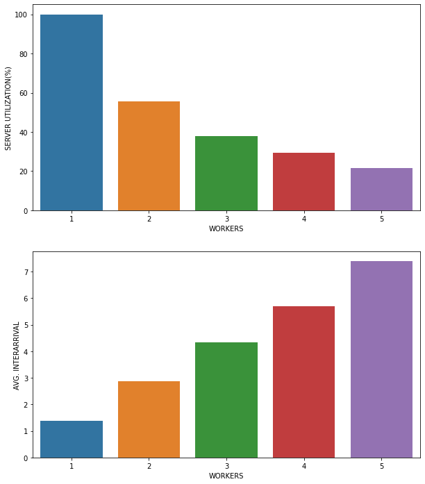

```python
import numpy as np
import pandas as pd
import matplotlib.pyplot as plt
import seaborn as sns
def toSec(x):
    return x/1000
def toSecDf(df):
    df['SERVICE_TIME']       = df['SERVICE_TIME'].apply(toSec)
    df['AVG_DELAY_QUEUE']    = df['AVG_DELAY_QUEUE'].apply(toSec)
    df['AVG_INTERARRIVAL']   = df['AVG_INTERARRIVAL'].apply(toSec)
    df['INTER_ARRIVAL']   = df['INTER_ARRIVAL'].apply(toSec)
    df['SERVER_UTILIZATION'] = df['SERVER_UTILIZATION']*100
    return df
def basicPlot(df):
    fig, axs = plt.subplots(2,figsize=(5,7))
    pdf = pd.pivot_table(dff,index=['WORKERS'])
    X = pdf[pdf.columns[1]]
    sns.barplot(x=X.index,y=X.values,ax=axs[0])
    axs[0].set_ylabel("SERVER UTILIZATION(%)")
    axs[0].set_xlabel("BINS")
    X = pdf[pdf.columns[0]]
    sns.barplot(x=X.index,y=X.values,ax=axs[1])
    axs[1].set_ylabel("AVG. INTERARRIVAL")
    axs[1].set_xlabel("BINS")
    plt.show()
```


```python
df = pd.read_csv('../results/data_01.csv')
df = toSecDf(df)
df.drop(['STD','MEAN','READ_RATIO','SIZE','SAS_SIZE','CONCURRENCY'], axis=1, inplace=True)
df
```


<div>
<style scoped>
    .dataframe tbody tr th:only-of-type {
        vertical-align: middle;
    }

    .dataframe tbody tr th {
        vertical-align: top;
    }

    .dataframe thead th {
        text-align: right;
    }
</style>
<table border="1" class="dataframe">
  <thead>
    <tr style="text-align: right;">
      <th></th>
      <th>WORKER_NAME</th>
      <th>NUM_REQUESTS</th>
      <th>WORKERS</th>
      <th>LOAD_BALANCER</th>
      <th>AVG_DELAY_QUEUE</th>
      <th>NUMBER_QUEUE</th>
      <th>SERVER_UTILIZATION</th>
      <th>SIMULATION_TIME</th>
      <th>SAMPLES</th>
      <th>INTER_ARRIVAL</th>
      <th>DISTRIBUTION</th>
      <th>SERVICE_TIME</th>
      <th>AVG_INTERARRIVAL</th>
      <th>NUM_DELAYS</th>
      <th>TEST_ID</th>
    </tr>
  </thead>
  <tbody>
    <tr>
      <th>0</th>
      <td>worker-0</td>
      <td>1022</td>
      <td>1</td>
      <td>ROUND-ROBIN</td>
      <td>65.627758</td>
      <td>47.013687</td>
      <td>99.9682</td>
      <td>1475444.000</td>
      <td>1000</td>
      <td>3.0</td>
      <td>NORMAL</td>
      <td>1.45</td>
      <td>1.406728</td>
      <td>1022</td>
      <td>0</td>
    </tr>
    <tr>
      <th>1</th>
      <td>worker-0</td>
      <td>521</td>
      <td>2</td>
      <td>ROUND-ROBIN</td>
      <td>1.639722</td>
      <td>0.640194</td>
      <td>57.1355</td>
      <td>1334431.125</td>
      <td>1000</td>
      <td>3.0</td>
      <td>NORMAL</td>
      <td>1.45</td>
      <td>2.783207</td>
      <td>521</td>
      <td>1</td>
    </tr>
    <tr>
      <th>2</th>
      <td>worker-1</td>
      <td>520</td>
      <td>2</td>
      <td>ROUND-ROBIN</td>
      <td>1.643905</td>
      <td>0.640945</td>
      <td>57.1446</td>
      <td>1333703.000</td>
      <td>1000</td>
      <td>3.0</td>
      <td>NORMAL</td>
      <td>1.45</td>
      <td>2.782419</td>
      <td>520</td>
      <td>1</td>
    </tr>
    <tr>
      <th>3</th>
      <td>worker-0</td>
      <td>345</td>
      <td>3</td>
      <td>ROUND-ROBIN</td>
      <td>0.760091</td>
      <td>0.203492</td>
      <td>37.2158</td>
      <td>1288659.875</td>
      <td>1000</td>
      <td>3.0</td>
      <td>NORMAL</td>
      <td>1.45</td>
      <td>4.405243</td>
      <td>345</td>
      <td>2</td>
    </tr>
    <tr>
      <th>4</th>
      <td>worker-1</td>
      <td>344</td>
      <td>3</td>
      <td>ROUND-ROBIN</td>
      <td>0.762867</td>
      <td>0.205406</td>
      <td>37.3821</td>
      <td>1277594.875</td>
      <td>1000</td>
      <td>3.0</td>
      <td>NORMAL</td>
      <td>1.45</td>
      <td>4.402616</td>
      <td>344</td>
      <td>2</td>
    </tr>
    <tr>
      <th>5</th>
      <td>worker-2</td>
      <td>344</td>
      <td>3</td>
      <td>ROUND-ROBIN</td>
      <td>0.761782</td>
      <td>0.204880</td>
      <td>37.3394</td>
      <td>1279056.625</td>
      <td>1000</td>
      <td>3.0</td>
      <td>NORMAL</td>
      <td>1.45</td>
      <td>4.407653</td>
      <td>344</td>
      <td>2</td>
    </tr>
    <tr>
      <th>6</th>
      <td>worker-0</td>
      <td>257</td>
      <td>4</td>
      <td>ROUND-ROBIN</td>
      <td>0.493142</td>
      <td>0.109818</td>
      <td>30.1303</td>
      <td>1154069.875</td>
      <td>1000</td>
      <td>3.0</td>
      <td>NORMAL</td>
      <td>1.45</td>
      <td>5.594243</td>
      <td>257</td>
      <td>3</td>
    </tr>
    <tr>
      <th>7</th>
      <td>worker-1</td>
      <td>257</td>
      <td>4</td>
      <td>ROUND-ROBIN</td>
      <td>0.492835</td>
      <td>0.109690</td>
      <td>30.1141</td>
      <td>1154693.500</td>
      <td>1000</td>
      <td>3.0</td>
      <td>NORMAL</td>
      <td>1.45</td>
      <td>5.597267</td>
      <td>257</td>
      <td>3</td>
    </tr>
    <tr>
      <th>8</th>
      <td>worker-2</td>
      <td>257</td>
      <td>4</td>
      <td>ROUND-ROBIN</td>
      <td>0.492184</td>
      <td>0.109420</td>
      <td>30.0796</td>
      <td>1156016.125</td>
      <td>1000</td>
      <td>3.0</td>
      <td>NORMAL</td>
      <td>1.45</td>
      <td>5.603681</td>
      <td>257</td>
      <td>3</td>
    </tr>
    <tr>
      <th>9</th>
      <td>worker-3</td>
      <td>257</td>
      <td>4</td>
      <td>ROUND-ROBIN</td>
      <td>0.492354</td>
      <td>0.109490</td>
      <td>30.0886</td>
      <td>1155671.500</td>
      <td>1000</td>
      <td>3.0</td>
      <td>NORMAL</td>
      <td>1.45</td>
      <td>5.602009</td>
      <td>257</td>
      <td>3</td>
    </tr>
    <tr>
      <th>10</th>
      <td>worker-0</td>
      <td>206</td>
      <td>5</td>
      <td>ROUND-ROBIN</td>
      <td>0.314415</td>
      <td>0.052995</td>
      <td>21.7552</td>
      <td>1222185.750</td>
      <td>1000</td>
      <td>3.0</td>
      <td>NORMAL</td>
      <td>1.45</td>
      <td>7.314798</td>
      <td>206</td>
      <td>4</td>
    </tr>
    <tr>
      <th>11</th>
      <td>worker-1</td>
      <td>206</td>
      <td>5</td>
      <td>ROUND-ROBIN</td>
      <td>0.314620</td>
      <td>0.053058</td>
      <td>21.7669</td>
      <td>1221529.000</td>
      <td>1000</td>
      <td>3.0</td>
      <td>NORMAL</td>
      <td>1.45</td>
      <td>7.310869</td>
      <td>206</td>
      <td>4</td>
    </tr>
    <tr>
      <th>12</th>
      <td>worker-2</td>
      <td>206</td>
      <td>5</td>
      <td>ROUND-ROBIN</td>
      <td>0.315037</td>
      <td>0.053179</td>
      <td>21.7875</td>
      <td>1220372.500</td>
      <td>1000</td>
      <td>3.0</td>
      <td>NORMAL</td>
      <td>1.45</td>
      <td>7.303942</td>
      <td>206</td>
      <td>4</td>
    </tr>
    <tr>
      <th>13</th>
      <td>worker-3</td>
      <td>205</td>
      <td>5</td>
      <td>ROUND-ROBIN</td>
      <td>0.316669</td>
      <td>0.053297</td>
      <td>21.7781</td>
      <td>1218021.875</td>
      <td>1000</td>
      <td>3.0</td>
      <td>NORMAL</td>
      <td>1.45</td>
      <td>7.302372</td>
      <td>205</td>
      <td>4</td>
    </tr>
    <tr>
      <th>14</th>
      <td>worker-4</td>
      <td>205</td>
      <td>5</td>
      <td>ROUND-ROBIN</td>
      <td>0.316420</td>
      <td>0.053225</td>
      <td>21.7659</td>
      <td>1218705.750</td>
      <td>1000</td>
      <td>3.0</td>
      <td>NORMAL</td>
      <td>1.45</td>
      <td>7.306474</td>
      <td>205</td>
      <td>4</td>
    </tr>
    <tr>
      <th>15</th>
      <td>worker-0</td>
      <td>1017</td>
      <td>1</td>
      <td>RANDOM</td>
      <td>49.344945</td>
      <td>34.697975</td>
      <td>99.9537</td>
      <td>1466999.375</td>
      <td>1000</td>
      <td>3.0</td>
      <td>NORMAL</td>
      <td>1.45</td>
      <td>1.441617</td>
      <td>1017</td>
      <td>0</td>
    </tr>
    <tr>
      <th>16</th>
      <td>worker-0</td>
      <td>527</td>
      <td>2</td>
      <td>RANDOM</td>
      <td>1.633407</td>
      <td>0.640974</td>
      <td>57.2835</td>
      <td>1342964.750</td>
      <td>1000</td>
      <td>3.0</td>
      <td>NORMAL</td>
      <td>1.45</td>
      <td>2.777537</td>
      <td>527</td>
      <td>1</td>
    </tr>
    <tr>
      <th>17</th>
      <td>worker-1</td>
      <td>504</td>
      <td>2</td>
      <td>RANDOM</td>
      <td>1.514637</td>
      <td>0.568508</td>
      <td>54.8284</td>
      <td>1342773.250</td>
      <td>1000</td>
      <td>3.0</td>
      <td>NORMAL</td>
      <td>1.45</td>
      <td>2.909165</td>
      <td>504</td>
      <td>1</td>
    </tr>
    <tr>
      <th>18</th>
      <td>worker-0</td>
      <td>349</td>
      <td>3</td>
      <td>RANDOM</td>
      <td>0.846308</td>
      <td>0.239864</td>
      <td>40.2507</td>
      <td>1231369.500</td>
      <td>1000</td>
      <td>3.0</td>
      <td>NORMAL</td>
      <td>1.45</td>
      <td>4.104221</td>
      <td>349</td>
      <td>2</td>
    </tr>
    <tr>
      <th>19</th>
      <td>worker-1</td>
      <td>376</td>
      <td>3</td>
      <td>RANDOM</td>
      <td>0.956643</td>
      <td>0.287058</td>
      <td>43.3312</td>
      <td>1253816.625</td>
      <td>1000</td>
      <td>3.0</td>
      <td>NORMAL</td>
      <td>1.45</td>
      <td>3.813021</td>
      <td>376</td>
      <td>2</td>
    </tr>
    <tr>
      <th>20</th>
      <td>worker-2</td>
      <td>330</td>
      <td>3</td>
      <td>RANDOM</td>
      <td>0.786701</td>
      <td>0.216780</td>
      <td>38.4766</td>
      <td>1197581.625</td>
      <td>1000</td>
      <td>3.0</td>
      <td>NORMAL</td>
      <td>1.45</td>
      <td>4.345568</td>
      <td>330</td>
      <td>2</td>
    </tr>
    <tr>
      <th>21</th>
      <td>worker-0</td>
      <td>260</td>
      <td>4</td>
      <td>RANDOM</td>
      <td>0.495428</td>
      <td>0.111465</td>
      <td>30.3752</td>
      <td>1155618.500</td>
      <td>1000</td>
      <td>3.0</td>
      <td>NORMAL</td>
      <td>1.45</td>
      <td>5.563127</td>
      <td>260</td>
      <td>3</td>
    </tr>
    <tr>
      <th>22</th>
      <td>worker-1</td>
      <td>277</td>
      <td>4</td>
      <td>RANDOM</td>
      <td>0.528538</td>
      <td>0.124255</td>
      <td>31.8923</td>
      <td>1178259.250</td>
      <td>1000</td>
      <td>3.0</td>
      <td>NORMAL</td>
      <td>1.45</td>
      <td>5.212723</td>
      <td>277</td>
      <td>3</td>
    </tr>
    <tr>
      <th>23</th>
      <td>worker-2</td>
      <td>214</td>
      <td>4</td>
      <td>RANDOM</td>
      <td>0.341181</td>
      <td>0.062507</td>
      <td>23.9151</td>
      <td>1168070.875</td>
      <td>1000</td>
      <td>3.0</td>
      <td>NORMAL</td>
      <td>1.45</td>
      <td>6.757497</td>
      <td>214</td>
      <td>3</td>
    </tr>
    <tr>
      <th>24</th>
      <td>worker-3</td>
      <td>289</td>
      <td>4</td>
      <td>RANDOM</td>
      <td>0.556180</td>
      <td>0.134944</td>
      <td>33.4131</td>
      <td>1191134.000</td>
      <td>1000</td>
      <td>3.0</td>
      <td>NORMAL</td>
      <td>1.45</td>
      <td>5.008681</td>
      <td>289</td>
      <td>3</td>
    </tr>
    <tr>
      <th>25</th>
      <td>worker-0</td>
      <td>214</td>
      <td>5</td>
      <td>RANDOM</td>
      <td>0.326524</td>
      <td>0.057916</td>
      <td>23.1531</td>
      <td>1206512.000</td>
      <td>1000</td>
      <td>3.0</td>
      <td>NORMAL</td>
      <td>1.45</td>
      <td>6.980425</td>
      <td>214</td>
      <td>4</td>
    </tr>
    <tr>
      <th>26</th>
      <td>worker-1</td>
      <td>227</td>
      <td>5</td>
      <td>RANDOM</td>
      <td>0.378555</td>
      <td>0.072255</td>
      <td>25.6621</td>
      <td>1189292.250</td>
      <td>1000</td>
      <td>3.0</td>
      <td>NORMAL</td>
      <td>1.45</td>
      <td>6.533814</td>
      <td>227</td>
      <td>4</td>
    </tr>
    <tr>
      <th>27</th>
      <td>worker-2</td>
      <td>201</td>
      <td>5</td>
      <td>RANDOM</td>
      <td>0.316480</td>
      <td>0.051937</td>
      <td>21.4000</td>
      <td>1224798.750</td>
      <td>1000</td>
      <td>3.0</td>
      <td>NORMAL</td>
      <td>1.45</td>
      <td>7.414595</td>
      <td>201</td>
      <td>4</td>
    </tr>
    <tr>
      <th>28</th>
      <td>worker-3</td>
      <td>201</td>
      <td>5</td>
      <td>RANDOM</td>
      <td>0.316619</td>
      <td>0.051978</td>
      <td>21.4076</td>
      <td>1224367.625</td>
      <td>1000</td>
      <td>3.0</td>
      <td>NORMAL</td>
      <td>1.45</td>
      <td>7.411988</td>
      <td>201</td>
      <td>4</td>
    </tr>
    <tr>
      <th>29</th>
      <td>worker-4</td>
      <td>181</td>
      <td>5</td>
      <td>RANDOM</td>
      <td>0.254519</td>
      <td>0.037784</td>
      <td>19.1861</td>
      <td>1219230.500</td>
      <td>1000</td>
      <td>3.0</td>
      <td>NORMAL</td>
      <td>1.45</td>
      <td>8.169742</td>
      <td>181</td>
      <td>4</td>
    </tr>
    <tr>
      <th>30</th>
      <td>worker-0</td>
      <td>1043</td>
      <td>1</td>
      <td>TWO-CHOICES</td>
      <td>72.920984</td>
      <td>52.778156</td>
      <td>99.9697</td>
      <td>1505877.875</td>
      <td>1000</td>
      <td>3.0</td>
      <td>NORMAL</td>
      <td>1.45</td>
      <td>1.392262</td>
      <td>1043</td>
      <td>0</td>
    </tr>
    <tr>
      <th>31</th>
      <td>worker-0</td>
      <td>516</td>
      <td>2</td>
      <td>TWO-CHOICES</td>
      <td>1.556923</td>
      <td>0.591707</td>
      <td>55.6597</td>
      <td>1358598.000</td>
      <td>1000</td>
      <td>3.0</td>
      <td>NORMAL</td>
      <td>1.45</td>
      <td>2.857307</td>
      <td>516</td>
      <td>1</td>
    </tr>
    <tr>
      <th>32</th>
      <td>worker-1</td>
      <td>515</td>
      <td>2</td>
      <td>TWO-CHOICES</td>
      <td>1.548855</td>
      <td>0.587147</td>
      <td>55.5225</td>
      <td>1361036.625</td>
      <td>1000</td>
      <td>3.0</td>
      <td>NORMAL</td>
      <td>1.45</td>
      <td>2.863528</td>
      <td>515</td>
      <td>1</td>
    </tr>
    <tr>
      <th>33</th>
      <td>worker-0</td>
      <td>344</td>
      <td>3</td>
      <td>TWO-CHOICES</td>
      <td>0.777315</td>
      <td>0.212371</td>
      <td>37.9312</td>
      <td>1259101.750</td>
      <td>1000</td>
      <td>3.0</td>
      <td>NORMAL</td>
      <td>1.45</td>
      <td>4.338886</td>
      <td>344</td>
      <td>2</td>
    </tr>
    <tr>
      <th>34</th>
      <td>worker-1</td>
      <td>345</td>
      <td>3</td>
      <td>TWO-CHOICES</td>
      <td>0.776919</td>
      <td>0.211516</td>
      <td>37.8455</td>
      <td>1267218.875</td>
      <td>1000</td>
      <td>3.0</td>
      <td>NORMAL</td>
      <td>1.45</td>
      <td>4.331947</td>
      <td>345</td>
      <td>2</td>
    </tr>
    <tr>
      <th>35</th>
      <td>worker-2</td>
      <td>345</td>
      <td>3</td>
      <td>TWO-CHOICES</td>
      <td>0.776888</td>
      <td>0.211502</td>
      <td>37.8444</td>
      <td>1267254.125</td>
      <td>1000</td>
      <td>3.0</td>
      <td>NORMAL</td>
      <td>1.45</td>
      <td>4.332067</td>
      <td>345</td>
      <td>2</td>
    </tr>
    <tr>
      <th>36</th>
      <td>worker-0</td>
      <td>258</td>
      <td>4</td>
      <td>TWO-CHOICES</td>
      <td>0.481198</td>
      <td>0.105261</td>
      <td>29.4948</td>
      <td>1179436.750</td>
      <td>1000</td>
      <td>3.0</td>
      <td>NORMAL</td>
      <td>1.45</td>
      <td>5.693306</td>
      <td>258</td>
      <td>3</td>
    </tr>
    <tr>
      <th>37</th>
      <td>worker-1</td>
      <td>258</td>
      <td>4</td>
      <td>TWO-CHOICES</td>
      <td>0.478503</td>
      <td>0.104185</td>
      <td>29.3577</td>
      <td>1184944.500</td>
      <td>1000</td>
      <td>3.0</td>
      <td>NORMAL</td>
      <td>1.45</td>
      <td>5.719892</td>
      <td>258</td>
      <td>3</td>
    </tr>
    <tr>
      <th>38</th>
      <td>worker-2</td>
      <td>258</td>
      <td>4</td>
      <td>TWO-CHOICES</td>
      <td>0.478369</td>
      <td>0.104132</td>
      <td>29.3508</td>
      <td>1185221.500</td>
      <td>1000</td>
      <td>3.0</td>
      <td>NORMAL</td>
      <td>1.45</td>
      <td>5.721226</td>
      <td>258</td>
      <td>3</td>
    </tr>
    <tr>
      <th>39</th>
      <td>worker-3</td>
      <td>258</td>
      <td>4</td>
      <td>TWO-CHOICES</td>
      <td>0.482133</td>
      <td>0.105637</td>
      <td>29.5427</td>
      <td>1177521.875</td>
      <td>1000</td>
      <td>3.0</td>
      <td>NORMAL</td>
      <td>1.45</td>
      <td>5.684062</td>
      <td>258</td>
      <td>3</td>
    </tr>
    <tr>
      <th>40</th>
      <td>worker-0</td>
      <td>205</td>
      <td>5</td>
      <td>TWO-CHOICES</td>
      <td>0.312743</td>
      <td>0.052103</td>
      <td>21.5574</td>
      <td>1230495.375</td>
      <td>1000</td>
      <td>3.0</td>
      <td>NORMAL</td>
      <td>1.45</td>
      <td>7.377151</td>
      <td>205</td>
      <td>4</td>
    </tr>
    <tr>
      <th>41</th>
      <td>worker-1</td>
      <td>204</td>
      <td>5</td>
      <td>TWO-CHOICES</td>
      <td>0.312990</td>
      <td>0.051958</td>
      <td>21.4217</td>
      <td>1228888.500</td>
      <td>1000</td>
      <td>3.0</td>
      <td>NORMAL</td>
      <td>1.45</td>
      <td>7.402099</td>
      <td>204</td>
      <td>4</td>
    </tr>
    <tr>
      <th>42</th>
      <td>worker-2</td>
      <td>205</td>
      <td>5</td>
      <td>TWO-CHOICES</td>
      <td>0.311309</td>
      <td>0.051668</td>
      <td>21.4761</td>
      <td>1235151.750</td>
      <td>1000</td>
      <td>3.0</td>
      <td>NORMAL</td>
      <td>1.45</td>
      <td>7.405071</td>
      <td>205</td>
      <td>4</td>
    </tr>
    <tr>
      <th>43</th>
      <td>worker-3</td>
      <td>205</td>
      <td>5</td>
      <td>TWO-CHOICES</td>
      <td>0.312565</td>
      <td>0.052048</td>
      <td>21.5471</td>
      <td>1231078.875</td>
      <td>1000</td>
      <td>3.0</td>
      <td>NORMAL</td>
      <td>1.45</td>
      <td>7.380654</td>
      <td>205</td>
      <td>4</td>
    </tr>
    <tr>
      <th>44</th>
      <td>worker-4</td>
      <td>205</td>
      <td>5</td>
      <td>TWO-CHOICES</td>
      <td>0.313362</td>
      <td>0.052291</td>
      <td>21.5924</td>
      <td>1228498.250</td>
      <td>1000</td>
      <td>3.0</td>
      <td>NORMAL</td>
      <td>1.45</td>
      <td>7.365182</td>
      <td>205</td>
      <td>4</td>
    </tr>
  </tbody>
</table>
</div>


```python
round_robin = df.loc[df['LOAD_BALANCER']=='ROUND-ROBIN']
random      = df.loc[df['LOAD_BALANCER']=='RANDOM']
two_choices = df.loc[df['LOAD_BALANCER']=='TWO-CHOICES']
```

# ROUND ROBIN


```python
basicPlot(round_robin)
```


    

    


# RANDOM


```python
random[random['TEST_ID']==4]['NUM_REQUESTS']
```


    25    214
    26    227
    27    201
    28    201
    29    181
    Name: NUM_REQUESTS, dtype: int64


```python
basicPlot(random)
```


    

    


# TWO CHOICES


```python
basicPlot(two_choices)
```


    

    


```python
def plott(*args,**kwargs):
    NR =kwargs.get('y','NUM_REQUESTS')
    I =kwargs.get('bins',4)
    RR = round_robin[round_robin['TEST_ID']==I][NR].to_numpy()
    R  = random[random['TEST_ID']==I][NR].to_numpy()
    TC =two_choices[two_choices['TEST_ID']==I][NR].to_numpy()
    test = pd.DataFrame({'ROUND ROBIN':RR,'TWO CHOICES':TC,'RANDOM':R})
    test.index=(range(1,I+2))
    fig,ax = plt.subplots(1,figsize=(10,7))
    xLabel = kwargs.get('xLabel','QUEUE SERVER')
    yLabel = kwargs.get('yLabel','NUMBER OF REQUESTS')
    ax.set_xlabel(xLabel)
    ax.set_ylabel(yLabel)
    test.plot(kind='bar',ax=ax)
    ax.legend(loc="upper right",bbox_to_anchor=(1.2, 1))

plott()
```


    

    


# Test #1


```python
df = toSecDf(pd.read_csv('../results/data.csv'))
dff =df[['SIMULATION_TIME','SERVER_UTILIZATION','AVG_INTERARRIVAL','SERVICE_TIME','TEST_ID','WORKERS']] 
```


```python
pdf = pd.pivot_table(dff,index=['WORKERS'])
pdf
```


<div>
<style scoped>
    .dataframe tbody tr th:only-of-type {
        vertical-align: middle;
    }

    .dataframe tbody tr th {
        vertical-align: top;
    }

    .dataframe thead th {
        text-align: right;
    }
</style>
<table border="1" class="dataframe">
  <thead>
    <tr style="text-align: right;">
      <th></th>
      <th>AVG_INTERARRIVAL</th>
      <th>SERVER_UTILIZATION</th>
      <th>SERVICE_TIME</th>
      <th>SIMULATION_TIME</th>
      <th>TEST_ID</th>
    </tr>
    <tr>
      <th>WORKERS</th>
      <th></th>
      <th></th>
      <th></th>
      <th></th>
      <th></th>
    </tr>
  </thead>
  <tbody>
    <tr>
      <th>1</th>
      <td>1.523071</td>
      <td>99.939000</td>
      <td>1.5</td>
      <td>1.466882e+06</td>
      <td>0</td>
    </tr>
    <tr>
      <th>2</th>
      <td>3.091116</td>
      <td>52.687000</td>
      <td>1.5</td>
      <td>1.388480e+06</td>
      <td>1</td>
    </tr>
    <tr>
      <th>3</th>
      <td>4.644696</td>
      <td>37.328267</td>
      <td>1.5</td>
      <td>1.268367e+06</td>
      <td>2</td>
    </tr>
    <tr>
      <th>4</th>
      <td>6.270896</td>
      <td>27.216825</td>
      <td>1.5</td>
      <td>1.243077e+06</td>
      <td>3</td>
    </tr>
    <tr>
      <th>5</th>
      <td>7.707261</td>
      <td>21.023160</td>
      <td>1.5</td>
      <td>1.257068e+06</td>
      <td>4</td>
    </tr>
  </tbody>
</table>
</div>


## Grafica #1
Utilizacion del servidor disminuye conforme la carga se distribuye a mas "bins"


```python
X = pdf[pdf.columns[1]]
ax= sns.barplot(x=X.index,y=X.values)
ax.set_ylabel("SERVER UTILIZATION(%)")
ax.set_xlabel("BINS")
```


    Text(0.5, 0, 'BINS')


    

    


## Grafica #2 
El interarribo promedio aumenta conforme se distribuye la carga a mas "bins"


```python
X = pdf[pdf.columns[0]]
ax = sns.barplot(x=X.index,y=X.values)
ax.set_ylabel("AVG. INTERARRIVAL")
```


    Text(0, 0.5, 'AVG. INTERARRIVAL')


    

    

